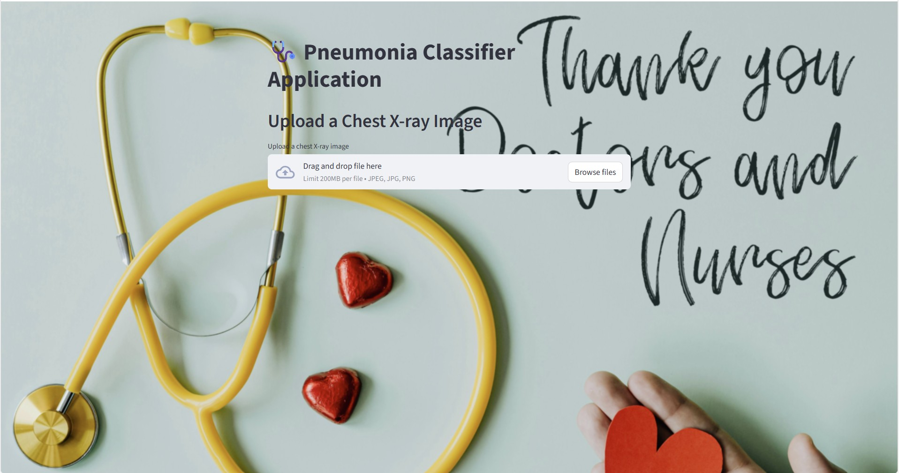
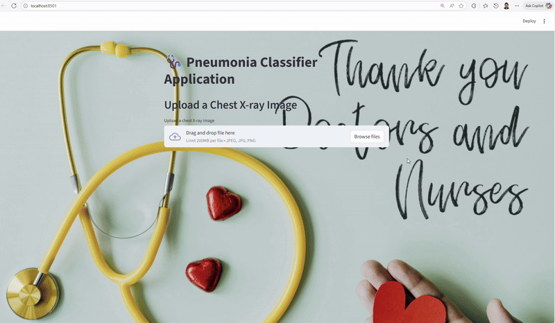

[](https://github.com/ellerbrock/open-source-badges/)

Badge [source](https://shields.io/)

# Pneumonia Classifier App

Pneumonia-Classifier-App is an image classification project that detects signs of pneumonia from chest X-ray images using a convolutional neural network (CNN) model built with TensorFlow. The application provides a simple web interface for users to upload X-ray images and receive predictions about the presence of pneumonia, powered by Streamlit for rapid deployment and ease of use.

## Authors

- [Samith Chimminiyan](https://www.github.com/samithcsachi)

## Table of Contents

- [Authors](#Authors)
- [Table of Contents](#table-of-contents)
- [Problem Statement](#problem-statement)
- [Tech Stack](#tech-stack)
- [Data source](#data-source)
- [Quick glance at the results](#quick-glance-at-the-results)
- [Limitation and what can be improved](#limitation-and-what-can-be-improved)
- [Lessons Learned and Recommendations](#lessons-learned-and-recommendations)
- [Run Locally](#run-locally)
- [Explore the notebook](#explore-the-notebook)
- [Contribution](#contribution)
- [License](#license)

## Problem Statement

Early and accurate detection of pneumonia is critical for effective treatment and patient outcomes. However, manual diagnosis from chest X-ray images can be time-consuming and prone to human error. This project aims to automate the process of pneumonia detection by leveraging deep learning techniques to analyze X-ray images, providing reliable predictions that assist healthcare professionals in clinical decision-making.

Streamlit App link : [https://pneumonia-classifier-app.streamlit.app/](https://pneumonia-classifier-app.streamlit.app/)
Hugging Face Space link : [https://huggingface.co/spaces/samithcs/Pneumonia-Classifier-App](https://huggingface.co/spaces/samithcs/Pneumonia-Classifier-App)

## Tech Stack

- Python
- TensorFlow
- Streamlit
- OpenCV
- Pillow
- Numpy
- Scipy

## Data Source

Data Source Link : -

[https://www.kaggle.com/datasets/paultimothymooney/chest-xray-pneumonia](https://www.kaggle.com/datasets/paultimothymooney/chest-xray-pneumonia)

- Data contains the Images Normal and Pneumonia infected chest X-rays.

## Quick glance at the results



- Test Accuracy: 87.02%

- Model evaluated on held-out test X-ray images.

## Limitation and what can be improved

- Limitations:

  - The model’s accuracy is dependent on the quality and size of the training data; real-world performance may vary if the input images differ from the training samples.

  - The application currently focuses only on binary classification (pneumonia vs. normal), without distinguishing between different types or severities of pneumonia.

  - It does not provide localization or highlighting of pneumonia regions within images.

  - The app is intended for educational and research purposes—not for clinical or diagnostic use without further validation.

- Possible Improvements:

  - Expand the dataset with more diverse and higher-quality images to improve model robustness.

  - Incorporate multi-class classification to distinguish between different pneumonia types.

  - Add visualization features such as heatmaps or bounding boxes to indicate affected lung areas.

  - Integrate explainable AI techniques for more transparent predictions.

  - Deploy the model with cloud-based APIs for scalability and remote access.

## Lessons Learned and Recommendations

- Lessons Learned:

  - Building deep learning models for medical imaging requires careful data preprocessing, class balancing, and validation to ensure trustworthy results.

  - Deployment with Streamlit enables rapid prototyping and user-friendly interfaces, making it easier to demonstrate and test models outside of local environments.

- Model generalizing is crucial—training and testing on diverse datasets helps improve reliability and real-world effectiveness.

- Recommendations:

  - Continuously validate the model on new, real-world datasets to monitor and improve performance.

  - Collaborate with medical professionals to align the application with clinical workflows and requirements.

  - Consider implementing additional checks and expandability features for greater transparency and trust in predictions.

  - For future projects, explore integrating advanced architectures (such as transfer learning and attention mechanisms) and addressing data annotation quality to further enhance outcomes.

## Run Locally

Initialize git

```bash
git init
```

Clone the project

```bash
git clone https://github.com/samithcsachi/Pneumonia-Classifier-App.git
```

Change the Directory

```bash
cd E:/Pneumonia-Classifier-App

```

Create the Virtual Environment

```bash
uv venv --python 3.11
```

Activate the venv environment

```bash
 .venv\Scripts\activate

```

initialize UV

```bash
uv init

```

Add the libraries

```bash
uv add numpy streamlit Pillow tensorflow opencv-python scipy
```

Train the model

```bash
python train_model.py
```

Run the app

```bash
streamlit run app.py
```

## Explore the notebook

GitHub : [https://github.com/samithcsachi/Pneumonia-Classifier-App](https://github.com/samithcsachi/Pneumonia-Classifier-App)

Kaggle : [https://www.kaggle.com/datasets/paultimothymooney/chest-xray-pneumonia](https://www.kaggle.com/datasets/paultimothymooney/chest-xray-pneumonia)

## Contribution

Pull requests are welcome! For major changes, please open an issue first to discuss what you would like to change or contribute.

## License

MIT License

Copyright (c) 2025 Samith Chimminiyan

Permission is hereby granted, free of charge, to any person obtaining a copy
of this software and associated documentation files (the "Software"), to deal
in the Software without restriction, including without limitation the rights
to use, copy, modify, merge, publish, distribute, sublicense, and/or sell
copies of the Software, and to permit persons to whom the Software is
furnished to do so, subject to the following conditions:

The above copyright notice and this permission notice shall be included in all
copies or substantial portions of the Software.

THE SOFTWARE IS PROVIDED "AS IS", WITHOUT WARRANTY OF ANY KIND, EXPRESS OR
IMPLIED, INCLUDING BUT NOT LIMITED TO THE WARRANTIES OF MERCHANTABILITY,
FITNESS FOR A PARTICULAR PURPOSE AND NONINFRINGEMENT. IN NO EVENT SHALL THE
AUTHORS OR COPYRIGHT HOLDERS BE LIABLE FOR ANY CLAIM, DAMAGES OR OTHER
LIABILITY, WHETHER IN AN ACTION OF CONTRACT, TORT OR OTHERWISE, ARISING FROM,
OUT OF OR IN CONNECTION WITH THE SOFTWARE OR THE USE OR OTHER DEALINGS IN THE
SOFTWARE.

Learn more about [MIT](https://choosealicense.com/licenses/mit/) license

## Contact

If you have any questions, suggestions, or collaborations in data science, feel free to reach out:

- 📧 Email: [samith.sachi@gmail.com](mailto:samith.sachi@gmail.com)
- 🔗 LinkedIn: [www.linkedin.com/in/samithchimminiyan](https://www.linkedin.com/in/samithchimminiyan)
- 🌐 Website: [https://samithcsachi.github.io/](https://samithcsachi.github.io/)
